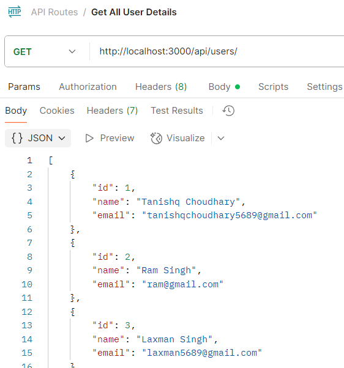

# Event-Management-API
A RESTful API built with Node.js, Express, and PostgreSQL for managing events and user registrations. It allows you to create and list events, register and cancel users for events, view event statistics, and ensures robust validation and business logic for real-world event management scenarios.

---

## Features
- Create, view, and list events
- User registration and cancellation for events
- Event statistics and capacity tracking
- Input validation and robust error handling
- Prevents double registration, overbooking, and registration for past events
- Safely handles concurrent registration and cancellation using database transactions and row-level locking
- Custom sorting for upcoming events
- Clean, modular code structure for scalability

---

## Folder Structure

```
Event-Management-API/
├── src/
│   ├── controllers/
│   │   ├── eventcontroller.js
│   │   └── usercontroller.js
│   ├── db/
│   │   └── index.js
│   ├── middleware/
│   │   └── validateinput.js
│   ├── models/
│   │   ├── event.js
│   │   ├── index.js
│   │   ├── registration.js
│   │   └── user.js
│   ├── routes/
│   │   ├── eventroutes.js
│   │   └── userroutes.js
│   ├── validators_input/
│   │   ├── eventvalidator.js
│   │   └── uservalidator.js
│   └── app.js
├── .env.example
├── package.json
├── server.js
└── README.md
```
---
## ER Diagram 


---

## Setup Instructions

### 1. Clone the Repository

```bash
git clone https://github.com/Tanishq4501/Event-Management-API
cd Event-Management-API-main
```

---

### 2. Install Dependencies

```bash
npm install
```

---

### 3. Configure Environment Variables

Create a `.env` file in the project root with the following content:

#### **For Local PostgreSQL Database**

1. **Create the database manually** (e.g., using psql or pgAdmin):

    ```sql
    CREATE DATABASE event_management;
    ```

2. **Set your local DB credentials in `.env`:**

    ```
    DB_HOST=localhost
    DB_PORT=5432
    DB_NAME=event_management
    DB_USER=your_postgres_user
    DB_PASSWORD=your_postgres_password
    ```

---

#### **For Deployed PostgreSQL Database (e.g., Render)**

1. **Provision a PostgreSQL database** on [Render](https://dashboard.render.com/) or another provider.
2. **Copy the connection details** from your provider and set them in `.env`:

    ```
    DB_HOST=your-render-host
    DB_PORT=5432
    DB_NAME=your-db-name
    DB_USER=your-db-user
    DB_PASSWORD=your-db-password
    ```

3. **If using Render or any provider that requires SSL,** ensure your Sequelize config includes:

    ```js
    dialectOptions: {
      ssl: {
        require: true,
        rejectUnauthorized: false
      }
    }
    ```

---

### 4. Start the Server

```bash
node server.js
```
or for development with auto-reload:
```bash
npx nodemon server.js
```

---

### 5. Database Table Creation

- The required tables will be created automatically in your database when the server starts, thanks to Sequelize’s sync feature.

---

## API Documentation

### Event Endpoints

#### Create Event
- **POST** `/api/events`
- **Body:**
  ```json
  {
    "title": "Tech Symposium",
    "date_time": "2024-07-01T10:00:00Z",
    "location": "Mumbai",
    "capacity": 100
  }
  ```
- **Success Response:**
  ```json
  {
    "eventId": 1,
    "message": "Event created successfully!"
  }
  ```

#### Get Event Details
- **GET** `/api/events/:id`
- **Success Response:**
  ```json
  {
    "id": 1,
    "title": "Tech Symposium",
    "date_time": "2024-07-01T10:00:00Z",
    "location": "Mumbai",
    "capacity": 100,
    "users": [ { "id": 1, "name": "Amit", "email": "amit@gmail.com" } ]
  }
  ```

#### Register for Event
- **POST** `/api/events/:id/register`
- **Body:**
  ```json
  { "userId": 1 }
  ```
- **Success Response:**
  ```json
  { "message": "User registered for the event successfully." }
  ```

#### Cancel Registration
- **POST** `/api/events/:id/cancel`
- **Body:**
  ```json
  { "userId": 1 }
  ```
- **Success Response:**
  ```json
  { "message": "Registration cancelled successfully." }
  ```

#### List Upcoming Events
- **GET** `/api/events/upcoming`
- **Success Response:**
  ```json
  [
    {
      "id": 1,
      "title": "Tech Symposium",
      "date_time": "2024-07-01T10:00:00Z",
      "location": "Mumbai",
      "capacity": 100
    },
    {
      "id": 2,
      "title": "Startup Meetup",
      "date_time": "2024-07-05T15:00:00Z",
      "location": "Delhi",
      "capacity": 200
    }
  ]
  ```

#### Event Stats
- **GET** `/api/events/:id/stats`
- **Success Response:**
  ```json
  {
    "total_registration": 10,
    "remaining_capacity": 90,
    "percentUsed": "10.00%"
  }
  ```

---

### User Endpoints

#### Create User
- **POST** `/api/users`
- **Body:**
  ```json
  { "name": "Priya", "email": "priya@gmail.com" }
  ```
- **Success Response:**
  ```json
  { "userId": 1 }
  ```

#### Get User
- **GET** `/api/users/:id`
- **Success Response:**
  ```json
  { "id": 1, "name": "Priya", "email": "priya@example.com" }
  ```

#### List All Users
- **GET** `/api/users`
- **Success Response:**
  ```json
  [
    { "id": 1, "name": "Priya", "email": "priya@gmail.com" },
    { "id": 2, "name": "Amit", "email": "amit@gmail.com" }
  ]
  ```

---

## Error Response Format

All errors return:
```json
{
  "message": "Error description.",
  "error": "Optional detailed error (for debugging)"
}
```

---

## 📸 API Screenshots

Below are screenshots of example requests and responses for each endpoint, as tested in Postman:

- **Create Event**

  

- **Get Event Details**

  

- **Register for Event**

  

- **Cancel Registration**

  

- **List Upcoming Events**

  

- **Event Stats**

  

- **Create User**

  

- **Get Single User Details**

  

- **Get All User Details**

   

---

## License

MIT 
